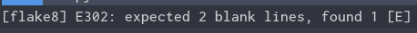

# Asynchronous Lint Engine [](https://travis-ci.org/w0rp/ale) [](https://ci.appveyor.com/project/w0rp/ale)


ALE (Asynchronous Lint Engine) is a plugin for providing linting in NeoVim
and Vim 8 while you edit your text files.


ALE makes use of NeoVim and Vim 8 job control functions and timers to
run linters on the contents of text buffers and return errors as
text is changed in Vim. This allows for displaying warnings and
errors in files being edited in Vim before files have been saved
back to a filesystem.

In other words, this plugin allows you to lint while you type.

In addition to linting support, ALE offers some support for fixing code with
formatting tools, and some Language Server Protocol and `tsserver` features.

## Table of Contents

1. [Supported Languages and Tools](#supported-languages)
2. [Usage](#usage)
    1. [Linting](#usage-linting)
    2. [Fixing](#usage-fixing)
    3. [Completion](#usage-completion)
    4. [Go To Definition](#usage-go-to-definition)
    5. [Find References](#usage-find-references)
3. [Installation](#installation)
    1. [Installation with Vim package management](#standard-installation)
    2. [Installation with Pathogen](#installation-with-pathogen)
    3. [Installation with Vundle](#installation-with-vundle)
4. [Contributing](#contributing)
5. [FAQ](#faq)
    1. [How do I disable particular linters?](#faq-disable-linters)
    2. [How can I keep the sign gutter open?](#faq-keep-signs)
    3. [How can I change the signs ALE uses?](#faq-change-signs)
    4. [How can I change or disable the highlights ALE uses?](#faq-change-highlights)
    5. [How can I show errors or warnings in my statusline?](#faq-statusline)
    6. [How can I show errors or warnings in my lightline?](#faq-lightline)
    7. [How can I change the format for echo messages?](#faq-echo-format)
    8. [How can I execute some code when ALE starts or stops linting?](#faq-autocmd)
    9. [How can I navigate between errors quickly?](#faq-navigation)
    10. [How can I run linters only when I save files?](#faq-lint-on-save)
    11. [How can I use the quickfix list instead of the loclist?](#faq-quickfix)
    12. [How can I check JSX files with both stylelint and eslint?](#faq-jsx-stylelint-eslint)
    13. [Will this plugin eat all of my laptop battery power?](#faq-my-battery-is-sad)
    14. [How can I configure my C or C++ project?](#faq-c-configuration)
    15. [How can I configure ALE differently for different buffers?](#faq-buffer-configuration)
    16. [How can I configure the height of the list in which ALE displays errors?](#faq-list-window-height)

<a name="supported-languages"></a>

## 1. Supported Languages and Tools

This plugin supports the following languages and tools. All available
tools will be run in combination, so they can be complementary.

<!--
Keep the table rows sorted alphabetically by the language name,
and the tools in the tools column sorted alphabetically by the tool
name. That seems to be the fairest way to arrange this table.

Remember to also update doc/ale.txt, which has a similar list with different
formatting.
-->

**Notes:**

* *^ No linters for text or Vim help filetypes are enabled by default.*
* *!! These linters check only files on disk. See `:help ale-lint-file-linters`*

| Language | Tools |
| -------- | ----- |
| ASM | [gcc](https://gcc.gnu.org) |
| Ansible | [ansible-lint](https://github.com/willthames/ansible-lint) |
| API Blueprint | [drafter](https://github.com/apiaryio/drafter) |
| AsciiDoc | [alex](https://github.com/wooorm/alex) !!, [proselint](http://proselint.com/), [redpen](http://redpen.cc/), [write-good](https://github.com/btford/write-good) |
| Awk | [gawk](https://www.gnu.org/software/gawk/)|
| Bash | shell [-n flag](https://www.gnu.org/software/bash/manual/bash.html#index-set), [shellcheck](https://www.shellcheck.net/), [shfmt](https://github.com/mvdan/sh) |
| Bourne Shell | shell [-n flag](http://linux.die.net/man/1/sh), [shellcheck](https://www.shellcheck.net/), [shfmt](https://github.com/mvdan/sh) |
| C | [cppcheck](http://cppcheck.sourceforge.net), [cpplint](https://github.com/google/styleguide/tree/gh-pages/cpplint), [clang](http://clang.llvm.org/), [clangtidy](http://clang.llvm.org/extra/clang-tidy/) !!, [clang-format](https://clang.llvm.org/docs/ClangFormat.html), [flawfinder](https://www.dwheeler.com/flawfinder/), [gcc](https://gcc.gnu.org/) |
| C++ (filetype cpp) | [clang](http://clang.llvm.org/), [clangcheck](http://clang.llvm.org/docs/ClangCheck.html) !!, [clangtidy](http://clang.llvm.org/extra/clang-tidy/) !!, [clang-format](https://clang.llvm.org/docs/ClangFormat.html), [cppcheck](http://cppcheck.sourceforge.net), [cpplint](https://github.com/google/styleguide/tree/gh-pages/cpplint) !!, [flawfinder](https://www.dwheeler.com/flawfinder/), [gcc](https://gcc.gnu.org/) |
| CUDA | [nvcc](http://docs.nvidia.com/cuda/cuda-compiler-driver-nvcc/index.html) |
| C# | [mcs](http://www.mono-project.com/docs/about-mono/languages/csharp/) see:`help ale-cs-mcs` for details, [mcsc](http://www.mono-project.com/docs/about-mono/languages/csharp/) !! see:`help ale-cs-mcsc` for details and configuration|
| Chef | [foodcritic](http://www.foodcritic.io/) |
| Clojure | [joker](https://github.com/candid82/joker) |
| CMake | [cmakelint](https://github.com/richq/cmake-lint) |
| CoffeeScript | [coffee](http://coffeescript.org/), [coffeelint](https://www.npmjs.com/package/coffeelint) |
| Crystal | [crystal](https://crystal-lang.org/) !! |
| CSS | [csslint](http://csslint.net/), [prettier](https://github.com/prettier/prettier), [stylelint](https://github.com/stylelint/stylelint) |
| Cucumber | [cucumber](https://cucumber.io/) |
| Cython (pyrex filetype) | [cython](http://cython.org/) |
| D | [dmd](https://dlang.org/dmd-linux.html) |
| Dafny | [dafny](https://rise4fun.com/Dafny) !! |
| Dart | [dartanalyzer](https://github.com/dart-lang/sdk/tree/master/pkg/analyzer_cli) !!, [language_server](https://github.com/natebosch/dart_language_server) |
| Dockerfile | [hadolint](https://github.com/hadolint/hadolint) |
| Elixir | [credo](https://github.com/rrrene/credo), [dialyxir](https://github.com/jeremyjh/dialyxir), [dogma](https://github.com/lpil/dogma) !!|
| Elm | [elm-format](https://github.com/avh4/elm-format), [elm-make](https://github.com/elm-lang/elm-make) |
| Erb | [erb](https://apidock.com/ruby/ERB), [erubi](https://github.com/jeremyevans/erubi), [erubis](https://github.com/kwatch/erubis) |
| Erlang | [erlc](http://erlang.org/doc/man/erlc.html), [SyntaxErl](https://github.com/ten0s/syntaxerl) |
| Fish | fish [-n flag](https://linux.die.net/man/1/fish)
| Fortran | [gcc](https://gcc.gnu.org/) |
| Fountain | [proselint](http://proselint.com/) |
| FusionScript | [fusion-lint](https://github.com/RyanSquared/fusionscript) |
| Git Commit Messages | [gitlint](https://github.com/jorisroovers/gitlint) |
| GLSL | [glslang](https://github.com/KhronosGroup/glslang), [glslls](https://github.com/svenstaro/glsl-language-server) |
| Go | [gofmt](https://golang.org/cmd/gofmt/), [goimports](https://godoc.org/golang.org/x/tools/cmd/goimports), [go vet](https://golang.org/cmd/vet/) !!, [golint](https://godoc.org/github.com/golang/lint), [gotype](https://godoc.org/golang.org/x/tools/cmd/gotype) !!, [gometalinter](https://github.com/alecthomas/gometalinter) !!, [go build](https://golang.org/cmd/go/) !!, [gosimple](https://github.com/dominikh/go-tools/tree/master/cmd/gosimple) !!, [staticcheck](https://github.com/dominikh/go-tools/tree/master/cmd/staticcheck) !! |
| GraphQL | [eslint](http://eslint.org/), [gqlint](https://github.com/happylinks/gqlint), [prettier](https://github.com/prettier/prettier) |
| Haml | [haml-lint](https://github.com/brigade/haml-lint) |
| Handlebars | [ember-template-lint](https://github.com/rwjblue/ember-template-lint) |
| Haskell | [brittany](https://github.com/lspitzner/brittany), [ghc](https://www.haskell.org/ghc/), [stack-ghc](https://haskellstack.org/), [stack-build](https://haskellstack.org/) !!, [ghc-mod](https://github.com/DanielG/ghc-mod), [stack-ghc-mod](https://github.com/DanielG/ghc-mod), [hlint](https://hackage.haskell.org/package/hlint), [hdevtools](https://hackage.haskell.org/package/hdevtools), [hfmt](https://github.com/danstiner/hfmt) |
| HTML | [alex](https://github.com/wooorm/alex) !!, [HTMLHint](http://htmlhint.com/), [proselint](http://proselint.com/), [tidy](http://www.html-tidy.org/), [write-good](https://github.com/btford/write-good) |
| Idris | [idris](http://www.idris-lang.org/) |
| Java | [checkstyle](http://checkstyle.sourceforge.net), [javac](http://www.oracle.com/technetwork/java/javase/downloads/index.html), [google-java-format](https://github.com/google/google-java-format), [PMD](https://pmd.github.io/) |
| JavaScript | [eslint](http://eslint.org/), [flow](https://flowtype.org/), [jscs](http://jscs.info/), [jshint](http://jshint.com/), [prettier](https://github.com/prettier/prettier), [prettier-eslint](https://github.com/prettier/prettier-eslint), [prettier-standard](https://github.com/sheerun/prettier-standard), [standard](http://standardjs.com/), [xo](https://github.com/sindresorhus/xo)
| JSON | [fixjson](https://github.com/rhysd/fixjson), [jsonlint](http://zaa.ch/jsonlint/), [jq](https://stedolan.github.io/jq/), [prettier](https://github.com/prettier/prettier) |
| Kotlin | [kotlinc](https://kotlinlang.org) !!, [ktlint](https://ktlint.github.io) !! see `:help ale-integration-kotlin` for configuration instructions |
| LaTeX | [alex](https://github.com/wooorm/alex) !!, [chktex](http://www.nongnu.org/chktex/), [lacheck](https://www.ctan.org/pkg/lacheck), [proselint](http://proselint.com/), [redpen](http://redpen.cc/), [vale](https://github.com/ValeLint/vale), [write-good](https://github.com/btford/write-good) |
| Less | [lessc](https://www.npmjs.com/package/less), [prettier](https://github.com/prettier/prettier), [stylelint](https://github.com/stylelint/stylelint) |
| LLVM | [llc](https://llvm.org/docs/CommandGuide/llc.html) |
| Lua | [luac](https://www.lua.org/manual/5.1/luac.html), [luacheck](https://github.com/mpeterv/luacheck) |
| Mail | [alex](https://github.com/wooorm/alex) !!, [proselint](http://proselint.com/), [vale](https://github.com/ValeLint/vale) |
| Make | [checkmake](https://github.com/mrtazz/checkmake) |
| Markdown | [alex](https://github.com/wooorm/alex) !!, [markdownlint](https://github.com/DavidAnson/markdownlint) !!, [mdl](https://github.com/mivok/markdownlint), [prettier](https://github.com/prettier/prettier), [proselint](http://proselint.com/), [redpen](http://redpen.cc/), [remark-lint](https://github.com/wooorm/remark-lint) !!, [textlint](https://textlint.github.io/), [vale](https://github.com/ValeLint/vale), [write-good](https://github.com/btford/write-good) |
| MATLAB | [mlint](https://www.mathworks.com/help/matlab/ref/mlint.html) |
| Mercury | [mmc](http://mercurylang.org) !! |
| Nim | [nim check](https://nim-lang.org/docs/nimc.html) !! |
| nix | [nix-instantiate](http://nixos.org/nix/manual/#sec-nix-instantiate) |
| nroff | [alex](https://github.com/wooorm/alex) !!, [proselint](http://proselint.com/), [write-good](https://github.com/btford/write-good)|
| Objective-C | [clang](http://clang.llvm.org/) |
| Objective-C++ | [clang](http://clang.llvm.org/) |
| OCaml | [merlin](https://github.com/the-lambda-church/merlin) see `:help ale-ocaml-merlin` for configuration instructions, [ols](https://github.com/freebroccolo/ocaml-language-server) |
| Perl | [perl -c](https://perl.org/), [perl-critic](https://metacpan.org/pod/Perl::Critic), [perltidy](https://metacpan.org/pod/distribution/Perl-Tidy/bin/perltidy) |
| PHP | [hack](http://hacklang.org/), [hackfmt](https://github.com/facebook/flow/tree/master/hack/hackfmt), [langserver](https://github.com/felixfbecker/php-language-server), [phan](https://github.com/phan/phan) see `:help ale-php-phan` to instructions, [php -l](https://secure.php.net/), [phpcs](https://github.com/squizlabs/PHP_CodeSniffer), [phpmd](https://phpmd.org), [phpstan](https://github.com/phpstan/phpstan), [phpcbf](https://github.com/squizlabs/PHP_CodeSniffer), [php-cs-fixer](http://cs.sensiolabs.org/) |
| PO | [alex](https://github.com/wooorm/alex) !!, [msgfmt](https://www.gnu.org/software/gettext/manual/html_node/msgfmt-Invocation.html), [proselint](http://proselint.com/), [write-good](https://github.com/btford/write-good) |
| Pod | [alex](https://github.com/wooorm/alex) !!, [proselint](http://proselint.com/), [write-good](https://github.com/btford/write-good) |
| Pony | [ponyc](https://github.com/ponylang/ponyc) |
| proto | [protoc-gen-lint](https://github.com/ckaznocha/protoc-gen-lint) |
| Pug | [pug-lint](https://github.com/pugjs/pug-lint) |
| Puppet | [puppet](https://puppet.com), [puppet-lint](https://puppet-lint.com) |
| Python | [autopep8](https://github.com/hhatto/autopep8), [black](https://github.com/ambv/black), [flake8](http://flake8.pycqa.org/en/latest/), [isort](https://github.com/timothycrosley/isort), [mypy](http://mypy-lang.org/), [prospector](http://github.com/landscapeio/prospector), [pycodestyle](https://github.com/PyCQA/pycodestyle), [pyls](https://github.com/palantir/python-language-server), [pylint](https://www.pylint.org/) !!, [yapf](https://github.com/google/yapf) |
| QML | [qmlfmt](https://github.com/jesperhh/qmlfmt), [qmllint](https://github.com/qt/qtdeclarative/tree/5.11/tools/qmllint) |
| R | [lintr](https://github.com/jimhester/lintr) |
| ReasonML | [merlin](https://github.com/the-lambda-church/merlin) see `:help ale-reasonml-ols` for configuration instructions, [ols](https://github.com/freebroccolo/ocaml-language-server), [refmt](https://github.com/reasonml/reason-cli) |
| reStructuredText | [alex](https://github.com/wooorm/alex) !!, [proselint](http://proselint.com/), [redpen](http://redpen.cc/), [rstcheck](https://github.com/myint/rstcheck), [vale](https://github.com/ValeLint/vale), [write-good](https://github.com/btford/write-good) |
| Re:VIEW | [redpen](http://redpen.cc/) |
| RPM spec | [rpmlint](https://github.com/rpm-software-management/rpmlint) (disabled by default; see `:help ale-integration-spec`) |
| Ruby | [brakeman](http://brakemanscanner.org/) !!, [rails_best_practices](https://github.com/flyerhzm/rails_best_practices) !!, [reek](https://github.com/troessner/reek), [rubocop](https://github.com/bbatsov/rubocop), [ruby](https://www.ruby-lang.org), [rufo](https://github.com/ruby-formatter/rufo) |
| Rust |  cargo !! (see `:help ale-integration-rust` for configuration instructions), [rls](https://github.com/rust-lang-nursery/rls), [rustc](https://www.rust-lang.org/), [rustfmt](https://github.com/rust-lang-nursery/rustfmt) |
| SASS | [sass-lint](https://www.npmjs.com/package/sass-lint), [stylelint](https://github.com/stylelint/stylelint) |
| SCSS | [prettier](https://github.com/prettier/prettier), [sass-lint](https://www.npmjs.com/package/sass-lint), [scss-lint](https://github.com/brigade/scss-lint), [stylelint](https://github.com/stylelint/stylelint) |
| Scala | [fsc](https://www.scala-lang.org/old/sites/default/files/linuxsoft_archives/docu/files/tools/fsc.html), [scalac](http://scala-lang.org), [scalastyle](http://www.scalastyle.org) |
| Slim | [slim-lint](https://github.com/sds/slim-lint) |
| SML | [smlnj](http://www.smlnj.org/) |
| Solidity | [solhint](https://github.com/protofire/solhint), [solium](https://github.com/duaraghav8/Solium) |
| Stylus | [stylelint](https://github.com/stylelint/stylelint) |
| SQL | [sqlint](https://github.com/purcell/sqlint) |
| Swift | [swiftlint](https://github.com/realm/SwiftLint), [swiftformat](https://github.com/nicklockwood/SwiftFormat) |
| Tcl | [nagelfar](http://nagelfar.sourceforge.net) !! |
| Terraform | [tflint](https://github.com/wata727/tflint) |
| Texinfo | [alex](https://github.com/wooorm/alex) !!, [proselint](http://proselint.com/), [write-good](https://github.com/btford/write-good)|
| Text^ | [alex](https://github.com/wooorm/alex) !!, [proselint](http://proselint.com/), [redpen](http://redpen.cc/), [textlint](https://textlint.github.io/), [vale](https://github.com/ValeLint/vale), [write-good](https://github.com/btford/write-good) |
| Thrift | [thrift](http://thrift.apache.org/) |
| TypeScript | [eslint](http://eslint.org/), [prettier](https://github.com/prettier/prettier), [tslint](https://github.com/palantir/tslint), tsserver, typecheck |
| Verilog | [iverilog](https://github.com/steveicarus/iverilog), [verilator](http://www.veripool.org/projects/verilator/wiki/Intro) |
| Vim | [vint](https://github.com/Kuniwak/vint) |
| Vim help^ | [alex](https://github.com/wooorm/alex) !!, [proselint](http://proselint.com/), [write-good](https://github.com/btford/write-good) |
| Vue | [prettier](https://github.com/prettier/prettier) |
| XHTML | [alex](https://github.com/wooorm/alex) !!, [proselint](http://proselint.com/), [write-good](https://github.com/btford/write-good) |
| XML | [xmllint](http://xmlsoft.org/xmllint.html) |
| YAML | [swaglint](https://github.com/byCedric/swaglint), [yamllint](https://yamllint.readthedocs.io/) |

<a name="usage"></a>

## 2. Usage

<a name="usage-linting"></a>

### 2.i Linting

Once this plugin is installed, while editing your files in supported
languages and tools which have been correctly installed,
this plugin will send the contents of your text buffers to a variety of
programs for checking the syntax and semantics of your programs. By default,
linters will be re-run in the background to check your syntax when you open
new buffers or as you make edits to your files.

The behaviour of linting can be configured with a variety of options,
documented in [the Vim help file](doc/ale.txt). For more information on the
options ALE offers, consult `:help ale-options` for global options and `:help
ale-linter-options` for options specified to particular linters.

<a name="usage-fixing"></a>

### 2.ii Fixing

ALE can fix files with the `ALEFix` command. Functions need to be configured
for different filetypes with the `g:ale_fixers` variable. For example, the
following code can be used to fix JavaScript code with ESLint:

```vim
" Put this in vimrc or a plugin file of your own.
" After this is configured, :ALEFix will try and fix your JS code with ESLint.
let g:ale_fixers = {
\   'javascript': ['eslint'],
\}

" Set this setting in vimrc if you want to fix files automatically on save.
" This is off by default.
let g:ale_fix_on_save = 1
```

The `:ALEFixSuggest` command will suggest some supported tools for fixing code,
but fixers can be also implemented with functions, including lambda functions
too. See `:help ale-fix` for detailed information.

<a name="usage-completion"></a>

### 2.iii Completion

ALE offers some support for completion via hijacking of omnicompletion while you
type. All of ALE's completion information must come from Language Server
Protocol linters, or from `tsserver` for TypeSript.

```vim
" Enable completion where available.
let g:ale_completion_enabled = 1
```

See `:help ale-completion` for more information.

<a name="usage-go-to-definition"></a>

### 2.iv Go To Definition

ALE supports jumping to the definition of words under your cursor with the
`:ALEGoToDefinition` command using any enabled LSP linters and `tsserver`.

See `:help ale-go-to-definition` for more information.

<a name="usage-find-references"></a>

### 2.v Find References

ALE supports finding references for words under your cursor with the
`:ALEFindReferences` command using any enabled LSP linters and `tsserver`.

See `:help ale-find-references` for more information.

<a name="installation"></a>

## 3. Installation

To install this plugin, you should use one of the following methods.
For Windows users, replace usage of the Unix `~/.vim` directory with
`%USERPROFILE%\vimfiles`, or another directory if you have configured
Vim differently. On Windows, your `~/.vimrc` file will be similarly
stored in `%USERPROFILE%\_vimrc`.

<a name="standard-installation"></a>

### 3.i. Installation with Vim package management

In Vim 8 and NeoVim, you can install plugins easily without needing to use
any other tools. Simply clone the plugin into your `pack` directory.

#### Vim 8 on Unix

```bash
mkdir -p ~/.vim/pack/git-plugins/start
git clone https://github.com/w0rp/ale.git ~/.vim/pack/git-plugins/start/ale
```

#### NeoVim on Unix

```bash
mkdir -p ~/.local/share/nvim/site/pack/git-plugins/start
git clone https://github.com/w0rp/ale.git ~/.local/share/nvim/site/pack/git-plugins/start/ale
```

#### Vim 8 on Windows

```bash
# Run these commands in the "Git for Windows" Bash terminal
mkdir -p ~/vimfiles/pack/git-plugins/start
git clone https://github.com/w0rp/ale.git ~/vimfiles/pack/git-plugins/start/ale
```

#### Generating Vim help files

You can add the following line to your vimrc files to generate documentation
tags automatically, if you don't have something similar already, so you can use
the `:help` command to consult ALE's online documentation:

```vim
" Put these lines at the very end of your vimrc file.

" Load all plugins now.
" Plugins need to be added to runtimepath before helptags can be generated.
packloadall
" Load all of the helptags now, after plugins have been loaded.
" All messages and errors will be ignored.
silent! helptags ALL
```

<a name="installation-with-pathogen"></a>

### 3.ii. Installation with Pathogen

To install this module with [Pathogen](https://github.com/tpope/vim-pathogen),
you should clone this repository to your bundle directory, and ensure
you have the line `execute pathogen#infect()` in your `~/.vimrc` file.
You can run the following commands in your terminal to do so:

```bash
cd ~/.vim/bundle
git clone https://github.com/w0rp/ale.git
```

<a name="installation-with-vundle"></a>

### 3.iii. Installation with Vundle

You can install this plugin using [Vundle](https://github.com/VundleVim/Vundle.vim)
by using the path on GitHub for this repository.

```vim
Plugin 'w0rp/ale'
```

See the Vundle documentation for more information.

<a name="contributing"></a>

## 4. Contributing

If you would like to see support for more languages and tools, please
[create an issue](https://github.com/w0rp/ale/issues)
or [create a pull request](https://github.com/w0rp/ale/pulls).
If your tool can read from stdin or you have code to suggest which is good,
support can be happily added for it.

If you are interested in the general direction of the project, check out the
[wiki home page](https://github.com/w0rp/ale/wiki). The wiki includes a
Roadmap for the future, and more.

If you'd liked to discuss the project more directly, check out the `#vim-ale` channel
on Freenode. Web chat is available [here](https://webchat.freenode.net/?channels=vim-ale).

<a name="faq"></a>

## 5. FAQ

<a name="faq-disable-linters"></a>

### 5.i. How do I disable particular linters?

By default, all available tools for all supported languages will be run.
If you want to only select a subset of the tools, simply create a
`g:ale_linters` dictionary in your vimrc file mapping filetypes
to lists of linters to run.

```vim
let g:ale_linters = {
\   'javascript': ['eslint'],
\}
```

For all languages unspecified in the dictionary, all possible linters will
be run for those languages, just as when the dictionary is not defined.
Running many linters should not typically obstruct editing in Vim,
as they will all be executed in separate processes simultaneously.

This plugin will look for linters in the [`ale_linters`](ale_linters) directory.
Each directory within corresponds to a particular filetype in Vim, and each file
in each directory corresponds to the name of a particular linter.

<a name="faq-keep-signs"></a>

### 5.ii. How can I keep the sign gutter open?

You can keep the sign gutter open at all times by setting the
`g:ale_sign_column_always` to 1

```vim
let g:ale_sign_column_always = 1
```

<a name="faq-change-signs"></a>

### 5.iii. How can I change the signs ALE uses?

Use these options to specify what text should be used for signs:

```vim
let g:ale_sign_error = '>>'
let g:ale_sign_warning = '--'
```

ALE sets some background colors automatically for warnings and errors
in the sign gutter, with the names `ALEErrorSign` and `ALEWarningSign`.
These colors can be customised, or even removed completely:

```vim
highlight clear ALEErrorSign
highlight clear ALEWarningSign
```

<a name="faq-change-highlights"></a>

### 5.iv. How can I change or disable the highlights ALE uses?

ALE's highlights problems with highlight groups which link to `SpellBad`,
`SpellCap`, `error`, and `todo` groups by default. The characters that are
highlighted depend on the linters being used, and the information provided to
ALE.

Highlighting can be disabled completely by setting `g:ale_set_highlights` to
`0`.

```vim
" Set this in your vimrc file to disabling highlighting
let g:ale_set_highlights = 0
```

You can control all of the highlights ALE uses, say if you are using a different
color scheme which produces ugly highlights. For example:

```vim
highlight ALEWarning ctermbg=DarkMagenta
```

See `:help ale-highlights` for more information.

<a name="faq-statusline"></a>

### 5.v. How can I show errors or warnings in my statusline?

[vim-airline](https://github.com/vim-airline/vim-airline) integrates with ALE
for displaying error information in the status bar. If you want to see the
status for ALE in a nice format, it is recommended to use vim-airline with ALE.
The airline extension can be enabled by adding the following to your vimrc:

```vim
" Set this. Airline will handle the rest.
let g:airline#extensions#ale#enabled = 1
```

If you don't want to use vim-airline, you can implement your own statusline
function without adding any other plugins. ALE provides a function for counting
the number of problems for this purpose, named `ale#statusline#Count`.

Say you want to display all errors as one figure, and all non-errors as another
figure. You can do the following:

```vim
function! LinterStatus() abort
    let l:counts = ale#statusline#Count(bufnr(''))

    let l:all_errors = l:counts.error + l:counts.style_error
    let l:all_non_errors = l:counts.total - l:all_errors

    return l:counts.total == 0 ? 'OK' : printf(
    \   '%dW %dE',
    \   all_non_errors,
    \   all_errors
    \)
endfunction

set statusline=%{LinterStatus()}
```

See `:help ale#statusline#Count()` for more information.

<a name="faq-lightline"></a>

### 5.vi. How can I show errors or warnings in my lightline?

[lightline](https://github.com/itchyny/lightline.vim) does not have built-in
support for ALE, nevertheless there is a plugin that adds this functionality: [maximbaz/lightline-ale](https://github.com/maximbaz/lightline-ale).

For more information, check out the sources of that plugin, `:help ale#statusline#Count()` and [lightline documentation](https://github.com/itchyny/lightline.vim#advanced-configuration).

<a name="faq-echo-format"></a>

### 5.vii. How can I change the format for echo messages?

There are 3 global options that allow customizing the echoed message.

- `g:ale_echo_msg_format` where:
    * `%s` is the error message itself
    * `%linter%` is the linter name
    * `%severity` is the severity type
- `g:ale_echo_msg_error_str` is the string used for error severity.
- `g:ale_echo_msg_warning_str` is the string used for warning severity.

So for example this:

```vim
let g:ale_echo_msg_error_str = 'E'
let g:ale_echo_msg_warning_str = 'W'
let g:ale_echo_msg_format = '[%linter%] %s [%severity%]'
```

Will give you:



<a name="faq-autocmd"></a>

### 5.viii. How can I execute some code when ALE starts or stops linting?

ALE runs its own [autocmd](http://vimdoc.sourceforge.net/htmldoc/autocmd.html)
events when a lint or fix cycle are started and stopped. These events can be
used to call arbitrary functions before and after ALE stops linting.

```vim
augroup YourGroup
    autocmd!
    autocmd User ALELintPre  call YourFunction()
    autocmd User ALELintPost call YourFunction()

    autocmd User ALEFixPre   call YourFunction()
    autocmd User ALEFixPost  call YourFunction()
augroup END
```

<a name="faq-navigation"></a>

### 5.ix. How can I navigate between errors quickly?

ALE offers some commands with `<Plug>` keybinds for moving between warnings and
errors quickly. You can map the keys Ctrl+j and Ctrl+k to moving between errors
for example:

```vim
nmap <silent> <C-k> <Plug>(ale_previous_wrap)
nmap <silent> <C-j> <Plug>(ale_next_wrap)
```

For more information, consult the online documentation with
`:help ale-navigation-commands`.

<a name="faq-lint-on-save"></a>

### 5.x. How can I run linters only when I save files?

ALE offers an option `g:ale_lint_on_save` for enabling running the linters
when files are saved. This option is enabled by default. If you only
wish to run linters when files are saved, you can turn the other
options off.

```vim
" Write this in your vimrc file
let g:ale_lint_on_text_changed = 'never'
" You can disable this option too
" if you don't want linters to run on opening a file
let g:ale_lint_on_enter = 0
```

If for whatever reason you don't wish to run linters again when you save
files, you can set `g:ale_lint_on_save` to `0`.

<a name="faq-quickfix"></a>

### 5.xi. How can I use the quickfix list instead of the loclist?

The quickfix list can be enabled by turning the `g:ale_set_quickfix`
option on. If you wish to also disable the loclist, you can disable
the `g:ale_set_loclist` option.

```vim
" Write this in your vimrc file
let g:ale_set_loclist = 0
let g:ale_set_quickfix = 1
```

If you wish to show Vim windows for the loclist or quickfix items
when a file contains warnings or errors, `g:ale_open_list` can be
set to `1`. `g:ale_keep_list_window_open` can be set to `1`
if you wish to keep the window open even after errors disappear.

```vim
let g:ale_open_list = 1
" Set this if you want to.
" This can be useful if you are combining ALE with
" some other plugin which sets quickfix errors, etc.
let g:ale_keep_list_window_open = 1
```

You can also set `let g:ale_list_vertical = 1` to open the windows vertically
instead of the default horizontally.

<a name="faq-jsx-stylelint-eslint"></a>

### 5.xii. How can I check JSX files with both stylelint and eslint?

If you configure ALE options correctly in your vimrc file, and install
the right tools, you can check JSX files with stylelint and eslint.

First, install eslint and install stylelint with
[stylelint-processor-styled-components](https://github.com/styled-components/stylelint-processor-styled-components).

Supposing you have installed both tools correctly, configure your .jsx files so
`jsx` is included in the filetype. You can use an `autocmd` for this.

```vim
augroup FiletypeGroup
    autocmd!
    au BufNewFile,BufRead *.jsx set filetype=javascript.jsx
augroup END
```

Supposing the filetype has been set correctly, you can set the following
options in your vimrc file:

```vim
let g:ale_linters = {'jsx': ['stylelint', 'eslint']}
let g:ale_linter_aliases = {'jsx': 'css'}
```

ALE will alias the `jsx` filetype so it uses the `css` filetype linters, and
use the original Array of selected linters for `jsx` from the `g:ale_linters`
object. All available linters will be used for the filetype `javascript`, and
no linter will be run twice for the same file.

<a name="faq-my-battery-is-sad"></a>

### 5.xiii. Will this plugin eat all of my laptop battery power?

ALE takes advantage of the power of various tools to check your code. This of
course means that CPU time will be used to continuously check your code. If you
are concerned about the CPU time ALE will spend, which will of course imply
some cost to battery life, you can adjust your settings to make your CPU do
less work.

First, consider increasing the delay before which ALE will run any linters
while you type. ALE uses a timeout which is cancelled and reset every time you
type, and this delay can be increased so linters are run less often. See
`:help g:ale_lint_delay` for more information.

If you don't wish to run linters while you type, you can disable that
behaviour. Set `g:ale_lint_on_text_changed` to `never` or `normal`. You won't
get as frequent error checking, but ALE shouldn't block your ability to edit a
document after you save a file, so the asynchronous nature of the plugin will
still be an advantage.

If you are still concerned, you can turn the automatic linting off altogether,
including the option `g:ale_lint_on_enter`, and you can run ALE manually with
`:ALELint`.

<a name="faq-c-configuration"></a>

### 5.xiv. How can I configure my C or C++ project?

The structure of C and C++ projects varies wildly from project to project, with
many different build tools being used for building them, and many different
formats for project configuration files. ALE can run compilers easily, but
ALE cannot easily detect which compiler flags to use.

Some tools and build configurations can generate
[compile_commands.json](https://clang.llvm.org/docs/JSONCompilationDatabase.html)
files. The `cppcheck`, `clangcheck` and `clangtidy` linters can read these
files for automatically determining the appropriate compiler flags to use.

For linting with compilers like `gcc` and `clang`, and with other tools, you
will need to tell ALE which compiler flags to use yourself. You can use
different options for different projects with the `g:ale_pattern_options`
setting.  Consult the documentation for that setting for more information.
`b:ale_linters` can be used to select which tools you want to run, say if you
want to use only `gcc` for one project, and only `clang` for another.

You may also configure buffer-local settings for linters with project-specific
vimrc files. [local_vimrc](https://github.com/LucHermitte/local_vimrc) can be
used for executing local vimrc files which can be shared in your project.

<a name="faq-buffer-configuration"></a>

### 5.xv. How can I configure ALE differently for different buffers?

ALE offers various ways to configure which linters or fixers are run, and
other settings. For the majority of ALE's settings, they can either be
configured globally with a `g:` variable prefix, or for a specific buffer
with a `b:` variable prefix. For example, you can configure a Python ftplugin
file like so.

```vim
" In ~/.vim/ftplugin/python.vim

" Check Python files with flake8 and pylint.
let b:ale_linters = ['flake8', 'pylint']
" Fix Python files with autopep8 and yapf.
let b:ale_fixers = ['autopep8', 'yapf']
" Disable warnings about trailing whitespace for Python files.
let b:ale_warn_about_trailing_whitespace = 0
```

For configuring files based on regular expression patterns matched against the
absolute path to a file, you can use `g:ale_pattern_options`.

```vim
" Do not lint or fix minified files.
let g:ale_pattern_options = {
\ '\.min\.js$': {'ale_linters': [], 'ale_fixers': []},
\ '\.min\.css$': {'ale_linters': [], 'ale_fixers': []},
\}
" If you configure g:ale_pattern_options outside of vimrc, you need this.
let g:ale_pattern_options_enabled = 1
```

Buffer-local variables for settings always override the global settings.

<a name="faq-list-window-height"></a>

### 5.xvi. How can I configure the height of the list in which ALE displays errors?

To set a default height for the error list, use the `g:ale_list_window_size` variable.

```vim
" Show 5 lines of errors (default: 10)
let g:ale_list_window_size = 5
```
